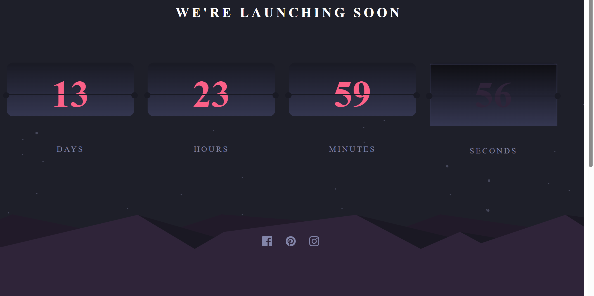

# Frontend Mentor - Launch countdown timer solution

This is a solution to the [Launch countdown timer challenge on Frontend Mentor](https://www.frontendmentor.io/challenges/launch-countdown-timer-N0XkGfyz-). Frontend Mentor challenges help you improve your coding skills by building realistic projects. 

## Table of contents

- [Overview](#overview)
  - [The challenge](#the-challenge)
  - [Screenshot](#screenshot)
  - [Links](#links)
- [My process](#my-process)
  - [Built with](#built-with)
  - [What I learned](#what-i-learned)
  - [Continued development](#continued-development)
  - [Useful resources](#useful-resources)
- [Author](#author)
- [Acknowledgments](#acknowledgments)

**Note: Delete this note and update the table of contents based on what sections you keep.**

## Overview

### The challenge

Users should be able to:

- See hover states for all interactive elements on the page
- See a live countdown timer that ticks down every second (start the count at 14 days)
- **Bonus**: When a number changes, make the card flip from the middle

### Screenshot

### Links

- Solution URL: [Github]()
- Live Site URL: [Live Github]()

## My process

### Built with

- Semantic HTML5 markup
- Sass/SCSS
- jQuery/Javascript
- Mobile-first workflow

### What I learned

- Thought it looked like the mountain range svg had added height. So I added that at the bottom using an empty div and a class in the scss file.
- For added practice I added a pause/start button with counter, that continues after a certain amount of time has expired , and continues where the timer should , so no time is lost. Though, you have to keep the counter window open/active or the counter stops, and only continues when you return to the page.
- It  works for any days,hours,minutes value, and test for non-integer values, or Infinity this can be changed in the onload function.
- I added the bonus flip , though it's more of a pseudo flip, it looks like a flip and I added , for pracice, a add/remove sound.
  button. I first wanted the app to automatically load a sound and play on each flip, but as I soon learned it's not advisable, as it could be annoying to users. So I added the button instead. It's impossible to align the sound to the flip this way though.
 
### Continued development

- Daily tutorials and projects in HTML5, CSS3, Javascript, Sass/SCSS. For now, in time I will go re-learn React ect.

### Useful resources

 

## Author

- Website - [One of my latest codepens](https://codepen.io/cynthiab72/pen/oNybYON)
- Frontend Mentor - [@cmb347827](https://www.frontendmentor.io/profile/cmb347827)

